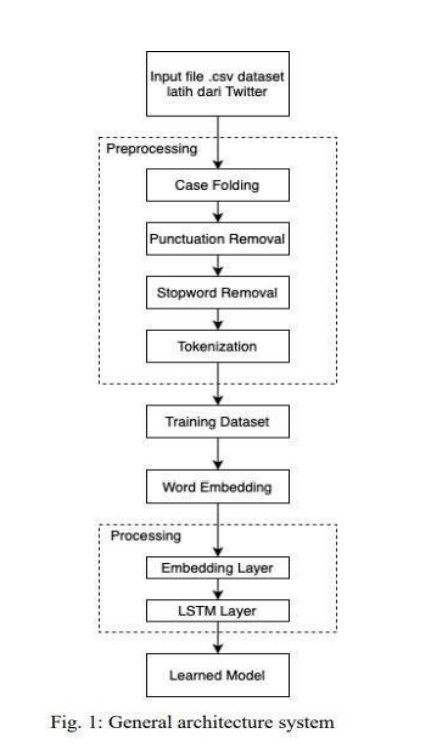
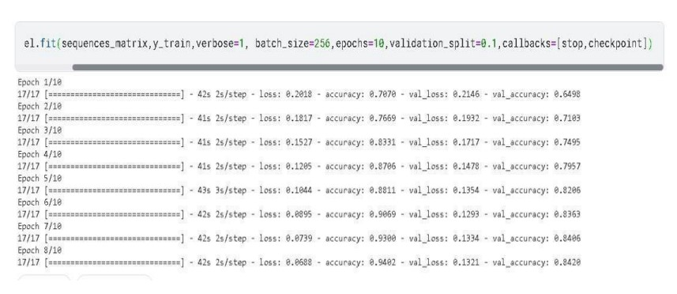
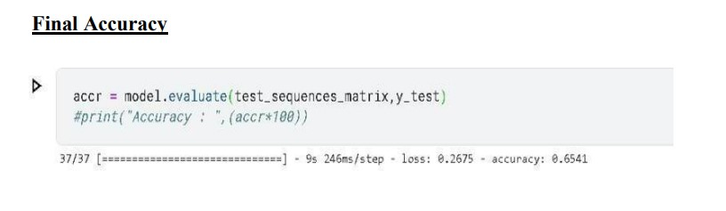
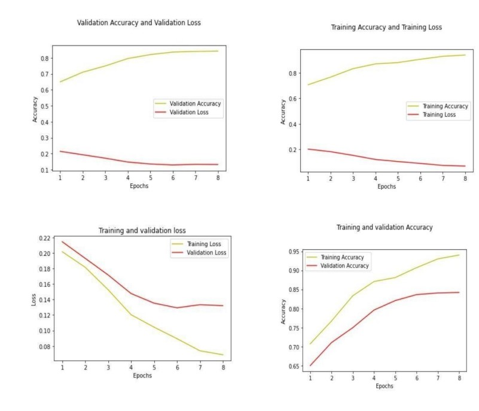
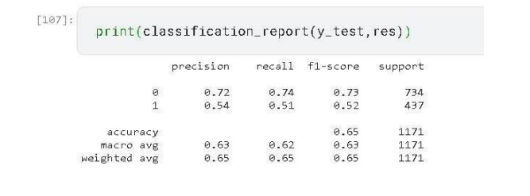
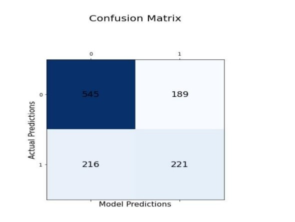

## Deep-Learning-Based-Approach-For-Detection-Of-Hate--And-Offensive-Speech-On-Social-Media

## OBJECTIVE
This aims to analyze and classify textual content into two class **non-hate offensive** or **hate-offensive** speech using **LSTM** on **Keras**.

### INTRODUCTION
Hate crimes are unfortunately nothing new in society. However, social media and other means of online communication have begun playing a larger role in hate crimes. For instance, suspects in several recent hate-related terror attacks had an extensive social media history of hate-related posts, suggesting that social media contributes to their radicalization . In some cases, social media can play an even more direct role; video footage from the suspect of the 2019 terror attack in Christchurch, New Zealand, was broadcast live on Facebook .
### WORKFLOW
This section introduces our method for hate speech detection. We firstly describe a light pre-processing procedure then introduce our LSTM, followed by our choice of input features initialisation for the model. 

### NLP Layers :
An artificial neural network consists of artificial neurons or processing elements and is organized in three interconnected layers: input, hidden that may include more than one layer, and output. 
Input Layer : Embedding 
Hidden Layer : DropOut Layer, LSTM 
Output Layer : Dense Laye 

### LSTM (Long short-term memory) 
LSTM networks are an extension of recurrent neural networks (RNNs) mainly introduced to handle situations where RNNs fail. Talking about RNN, it is a network that works on the present input by taking into consideration the previous output (feedback) and storing in its memory for a short period of time (short-term memory). Out of its various applications, the most popular ones are in the fields of speech processing, non-Markovian control, and music composition.
### ACTIVATION FUNCTION
The activation function is a non-linear transformation that we do over the input before sending it to the next layer of neurons or finalizing it as output. 
ReLu Activation Function 
Sigmoid Activation Function 
### OPTIMIZER
ADAM Optimizer

### LOSS AND ACCURACY
The training loss indicates how well the model is fitting the training data, while the validation loss indicates how well the model fits new data.Validation loss is a metric used to assess the performance of a deep learning model on the validation set. The validation set is a portion of the dataset set aside to validate the performance of the model. The validation loss is similar to the training loss and is calculated from the sum of errors for each example in the validation set. 

 

### RESULT

### CLASSIFICATION REPORT

### CONFUSION MATRIX

### CONCLUSION
As hate speech continues to be a societal problem, the need for automatic hate speech detection systems becomes more apparent. We presented the current approaches for this task as well as a new system that achieves reasonable accuracy.We also proposed a new approach that can outperform existing systems at thistask, with the added benefit of improved interpretability. Given all the challenges that remain, there is a need for more research on this problem, including both technical and practical matters. The custom LSTM (RNN) achieved an accuracy of 65%, where some classes have F1 score of 0 is 73% and for 1 is 52%.

